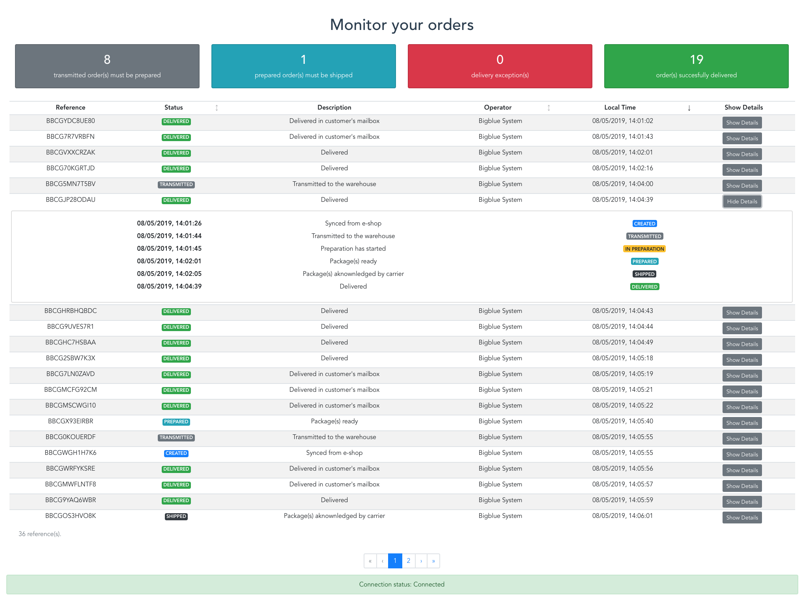

# Monitoring page

This project displays fulfillment orders in a table. Each order reference is a row where you can see the current status and the history of the order.
The table can be sorted according to order status, time, and operator.



The data comes from the mock API that can be found [here](https://github.com/bigbluedisco/tech-challenge/releases/tag/0.1.1), which implements Server-Sent Events.
This API runs on `localhost:8080/`

You need to **enable CORS** with intercepted URL `http://localhost:8080/*` to make the project work.

## Stack

- Vue.js (Vue CLI 3)
- Bootstrap 4
- [Wrapper for the EventSource API](https://github.com/fanout/reconnecting-eventsource)

## Project setup
```
npm install
```

### Compiles and hot-reloads for development
```
npm run serve
```
=> Go to `http://localhost:8081/`

Don't forget to launch the mock API and to enable CORS to get some data!

### Compiles and minifies for production
```
npm run build
```

### Lints and fixes files
```
npm run lint
```
